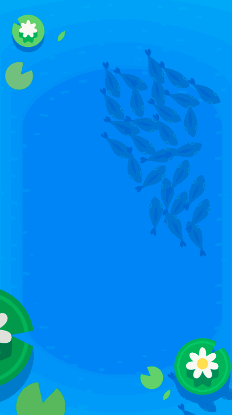
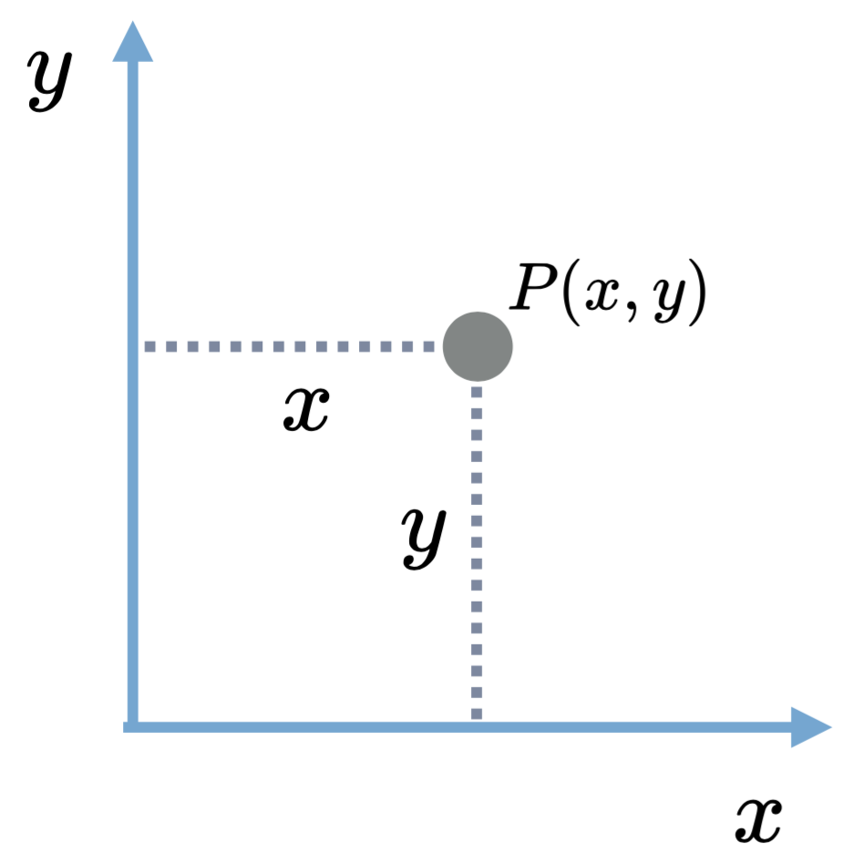

> [info]
> Xcode 8 and Swift 3 was released on on September 13th, 2016. Please make sure to update as soon as possible. [The first lesson](https://www.makeschool.com/academy/tutorial/getting-started-with-xcode-playgrounds-0afee09b-0bdb-47bd-8551-e179266b6b65/get-started-with-xcode-74d7476e-22f1-403c-99ab-b767f1a7b71e) has been updated with instructions for checking your version and updating if necessary.

**This is an archive of the Xcode 7 instructions. Go back to the dashboard to find the Xcode 8 version.**

Let's put all of our knowledge to the test and program some fish artificial intelligence!

When we're finished, we'll have something like this!



# What are boids?

"Boid" is short for "bird-oid object" or "bird-like object". Its origin goes back to a [research paper](http://dl.acm.org/citation.cfm?doid=37401.37406) published in the 80s by that described the concepts we'll be discussing today.

A _boid_ is a member of a simulation that only uses the information _it has_ to navigate the world. Each individual fish will use information about its neighbors and environment to stay close to other fish, avoid colliding with them, and try to move in the same direction.

These simple rules make the artificial intelligence of a single fish very simple. Complex flocking or [schooling](https://www.youtube.com/watch?v=D6HdoIsLMFg) behavior comes from introducing multiple fish using the same or similar rules.

These basic concepts have been used to simulate groups animals, crowds, and even social networks. Boids are useful for any system that is the combination of many "independent actors" (fish are our "actors").

# Math & physics review

Before we move any further, let's make sure we are on the same page with some math concepts you'll need for this project. Some of these are simple, but make sure to read everything so you don't end up missing something important!

## Sum

The sum of elements is _every element added together_.

If we had an array of `[1, 2, 3, 4]`, then it's sum would be `1 + 2 + 3 + 4` or `10`.

## Average

The average of elements is _the sum of the elements divided by the total number of elements_.

If we had an array of `[1, 2, 3, 4]`, then it's sum would be `(1 + 2 + 3 + 4) / 4` or `2.5`.

## Points



When working in two-dimensional space, we represent position with a "point" or combination of _x_ and _y_ values. These points are an offset from the "origin" (the bottom left in our case). _x_ values increase to the right and _y_ values increase upwards.

To represent something `5` units to the right of the origin, we would say it has a position of `(5, 0)`. To represent something `5` units to the right and `2` units up, we would say it has a position of `(5, 2)`.

> [info]
>
> When programming for iOS, we usually use the `CGPoint` data type to represent positions and other two-dimensional values. Here are some common operations you need for `CGPoint`s. There are a few more that we'll tell you about throughout the tutorial!
>
**Creating a CGPoint**
>
```
let myPoint: CGPoint = CGPoint(x: 5, y: 2)
```
>
**Accessing the x or y values**
>
```
let xValue: CGFloat = myPoint.x
let yValue: CGFloat = myPoint.y
```
>
**Adding two points together**
>
```
let myOtherPoint: CGPoint = CGPoint(x: 1, y: 1)
let myNewPoint: CGPoint = myPoint + myOtherPoint
// myNewPoint now contains (6, 3)
```
>
> **Woah, what's a CGFloat?**
>
> `CGFloat` is a special type for decimal values we use when working with graphics on iOS. The "CG" in `CGPoint` and `CGFloat` stands for "Core Graphics", a framework used for displaying things on the screen.
>
> While you can create a `CGPoint` with `Int`, `Double`, or `CGFloat` values, they are always converted to `CGFloat`s. This means our x and y values will always be `CGFloat`s. The biggest issue is arithmetic operations can only be performed between a `CGFloat` and another `CGFloat`. There is a single line in this project where it will matter (you'll need to "convert" an `Int` to a `CGFloat`). Don't worry, we'll remind you!

## Speed

The speed of an element is how far it moves in a given period of time.

When an element has a speed of 10 units per second, does that mean that after two seconds of travel it is 20 units away from where it started?

Not necessarily! We do not have enough information to know for sure... If the element moved forward for one second and then backwards for one second then it would end up in the exact same spot!

## Velocity

Velocity is speed with a direction. It solves the "not enough information" problem of speed.

When an element has a velocity of 10 units per second _in the positive x direction_ we know for certain that after two seconds of travel, that element is 20 units to the right of where it started!

## Vectors

A vector is a direction with a magnitude. This means it represents both direction and a value which makes it perfect for representing velocity!

Just like points in two-dimensions, vectors in two-dimensions are represented as a combination of _x_ and _y_ values. For our use case, a vector is just a fancy _point_. To represent something moving 10 units to the right and 20 units down, we would say it has a velocity of `(10, -20)`.

Each of our fish will have a velocity that determines its new position every calculation. A fish will update its velocity to change its direction.

Vectors are also used to represent how to move from one point to another.

> [info]
>
> Since vectors are so similar to points, we'll be using `CGPoint` to store their data. In addition to the things described above, you'll need to know how to do the following...
>
**Scaling a vector**
>
Vectors can be scaled or stretched. When you have a velocity and need to increase it to 3 times its original value, you "scale" it.
>
```
let myVector: CGPoint = CGPoint(x: 2, y: 3)
let myScaledVector: CGPoint = myVector * 3
// myScaledVector now contains (6, 9)
```
>
You could also do the opposite and decrease its value by scaling by a number less than one.
>
**Reversing a vector**
>
The direction of a vector can be reversed by scaling it by -1.
>
```
let myReversedVector: CGPoint = myVector * -1
// myReversedVector now contains (-2, -3)
```
>
**Vector between two points**
>
> To get a vector from one point to another, we subtract the origin from the destination.
>
```
let originPoint: CGPoint = CGPoint(x: 1, y: 3)
let destinationPoint: CGPoint = CGPoint(x: 10, y: 10)
let vectorFromOrigin: CGPoint = destinationPoint - originPoint
```

# Sum of [CGPoint]

Let's start applying that math review!

> [action]
>
1. Download the starter project from [here](https://github.com/MakeSchool-Tutorials/Intro-Flocking-Swift-Starter/archive/master.zip).
1. Double-click the downloaded zip file to "extract it".
1. Drag this newly extracted folder into your "Make School Projects" folder.
1. Open your "Make School Projects" folder and double-click `MakeSchoolOfFish.xcodeproj` and single-click `Fish.swift` in the left-side navigation to get started!

Towards the bottom of `Fish.swift` you should see a function called `sum`. This function takes in an array of `CGPoint` and is expected to return the sum of all points. Lucky for us, `CGPoint` values can be added directly to each other.

> [challenge]
>
> Fill in the body for `sum(of points: [CGPoint]) -> CGPoint`. If there are no elements in the `points` array, it should return `CGPoint(x: 0, y: 0)`. If there are elements, it should iterate over each to calculate and return the sum.

# Average of [CGPoint]

Find the `average` function (it should be below `sum`). This function will take in an array of `CGPoint` and is expected to return the average value. Averages for points work the same as averages for numbers expect there is a x-value and y-value that both get averaged! Lucky for us, `CGPoint` can be added together and divided by a `CGFloat`.

This is the one place you'll need to convert an `Int` to a `CGFloat`. You can do this with `CGFloat(myIntValue)` where `myIntValue` is the value you need to convert.

> [challenge]
>
> Fill in the body for `average(of points: [CGPoint]) -> CGPoint`. If there are no elements in the `points` array, it should return `CGPoint(x: 0, y: 0)`. If there are elements, it should calculate the average using the `sum` function you just created.
>
> Remember to manually return `CGPoint(x: 0, y: 0)` if there are no elements in the array. If you do not and average is called with an empty `points` array, then your code will crash for trying to divide by zero!

# Vector to a CGPoint

Find the `vectorTo` method (it should be the last method in the `Fish` class). This function takes in a `CGPoint` and is expected to return the vector from `self.position` to that point.

> [challenge]
>
> Fill in the body for `vectorTo(point point: CGPoint) -> CGPoint`. It should return the vector from `self.position` to `point`. See the math review above if you need help with this!

<!--  -->

> [info]
>
> The `position` instance variable is inherited from `SKSpriteNode`. `SKSpriteNode` is part of _Sprite Kit_ -- Apple's game engine. We are using _Sprite Kit_ to display this simulation so we have directly subclasses `SKSpriteNode` for each fish on the screen.

# Vector to center of [CGPoint]

One last math helper! Find the `vectorToCenterPoint` method (it should be above `vectorTo`). This function takes in an array of `CGPoint` and is expected to return the vector from `self.position` to the average point of that array.

> [challenge]
>
> Fill in the body for `vectorToCenterPoint(of points: [CGPoint]) -> CGPoint`. If there are no elements in the `points` array, it should return `CGPoint(x: 0, y: 0)` -- you must do this manually! If there are elements, it should calculate the average using the `average` function you just created and return the vector to that average point using the `vectorTo` function you just created.
