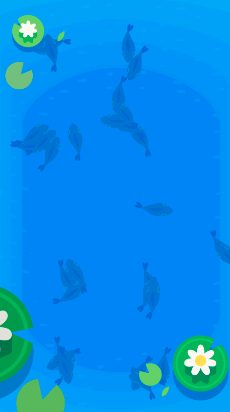
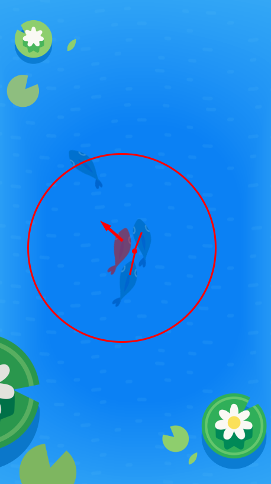
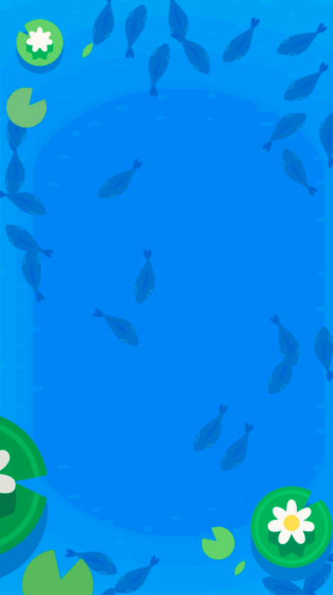
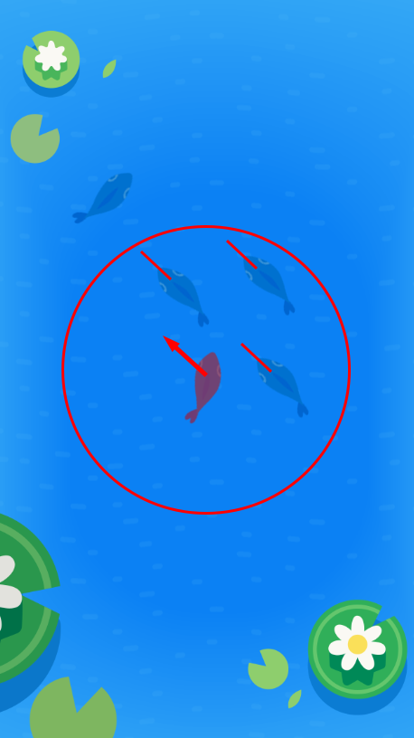
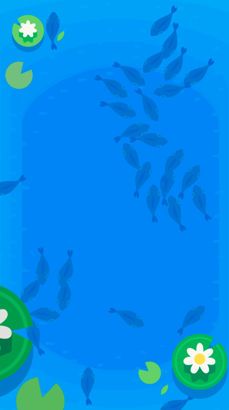

Now that we've completed the really math-y functions, we can get started on coding some of this swarm intelligence!

Each fish use use three rules to navigate its environment:

- Cohesion: sticking together
- Separation: avoiding collisions
- Alignment: mimicking neighbors

With these three, simple rules we'll start to observe an "emergent behavior". While the three rules are each simple on their own, the combination of them creates a complex system that closely mimics actual fish behavior!

# A quick introduction to delegates

A delegate is reference to another instance that is used to communicate between instances. Each fish has a `delegate` instance variable that can be used to get information about the fish's environment. This `delegate` can provide:

- the positions of other fish within a distance
- the velocities of other fish within a distance
- the location of food (if any)
- the location of a ripple (if any)

We'll let you know how to access the relevant information as needed for implementing the rules.

# Understanding Fish.swift

Take a look around the rest of `Fish.swift`. You should notice the following:

- The global constants `NumberOfFish`, `StartingSpeed`, `MaximumSpeed`, `ScreenMargin`. Do not mess with these right now, they are set to decent values for testing.
- The instance variables `velocity` and `delegate`. We'll use `delegate` to get information about the fish around our fish and update the `velocity` with each frame calculation.
- The instance constants for each rule (`cohesionVisibleDistance`, `cohesionWeight`, etc). We'll discuss each of these with their rule.
- The instance methods for each rule (`calculateCohesion`, `calculateAlignment`, etc). We'll discuss each of these with their rule.
- The instance method `updateVelocity`. This method is called automatically for each fish before each new "frame" is rendered to the screen. You'll call each rule's method and sum them up in here. Depending on your device, `updateVelocity` will be called somewhere between 15 and 60 times a second per fish. After `updateVelocity` is called, the newly calculated velocity is used to update the fish's position (we've written this code already).

> [action]
> Run the app (on a device if you have one) and check out the simulation in the current state.
>
> You should see a fish on the screen aimlessly swimming with no purpose and no thoughts. If they hit the edge, they turn directly away from it and continue swimming.

# Cohesion: sticking together

Fish want to be near other fish. This is our first rule and the concept of cohesion.

## How does this work?

Imagine you are in a crowd of people. How do you determine where to go if you want to be close to as many people as possible?

You might look around and find the people within a reasonable distance from you. After that, you might move towards the center of those people. Our fish is going to do something very similar!

For this rule, we want to find the _positions_ of all the fish within `cohesionVisibleDistance`. Once you have those positions, you want to move towards the center point of those fish. Think through what you've already programmed on the math side... What function would be good for this?

In this diagram, the red fish is being simulated. It can see any fish within the red circle. It calculates the center point of those fish (the red dot) and moves towards it.

> [challenge]
>
> Fill out `calculateCohesion`. It should:
>
1. Use `delegate.fishPositions(within: cohesionVisibleDistance, of: self)` to get the positions of all fish within the constant.
1. Calculate a vector to the center of those position points.
1. Return the calculated vector divided by `cohesionWeight`.
>
> Update `updateVelocity` to use this new rule. `updateVelocity` should:
>
1. Call `calculateCohesion` and save it to a variable.
1. Reassign the `velocity` instance variable to be the sum of the previous `velocity` and the newly calculated cohesion.
1. Make sure there is a call to `clampVelocity` after you update the `velocity` instance variable.
>
> Run the app and check it out!

## What is the weight for?

We will use these "weight" values to calibrate how much affect each rule has on our fish. If the fish cared about each rule equally, it would be hard for it to make any real decisions! Leave the weights at the suggest values for now, you can experiment with them once the simulation is finished.

It's important to note that these weights are inversely correlated to their effect. A large weight means that the rule has very little influence while a small weight means it has a lot of influence.

Why is this? Because we are dividing by the weight. If we wanted to be directly correlated (large weight means large influence), we would multiple by the weight instead. The problem with this is our current velocity should have a lot of influence so doing so would mean that all of our rule weights would need to be less than one. It's a bit cleaner (in our opinion) to use inversely correlated weights instead of weights less than one.

## Success!

At the end of this rule you should see the fish clumping together...

# Separation: avoiding collisions

Fish do not want to run into other fish. They appreciate their personal space! This is our second rule and the concept of separation.

## How does this work?

Imagine you are in a crowd of people. How do you avoid bumping into other people as you walk around?

You might look around for people close to you. If you see anyone close, you would move away from them.

For this rule, we want to find the _positions_ of all the fish within `separationDistance`. Once you have those positions, you want to move **away** from the center point of those fish. This will be very similar to cohesion but with different distance and weight.

In this diagram, the red fish is being simulated. It can see any fish within the red circle. It calculates the center point of those fish (the red dot) and moves away from it. When this is combined with cohesion (and proper weights are used), the fish will move towards each other but try not to bump into others.

> [challenge]
>
> Fill out `calculateSeparation`. It should:
>
1. Use `delegate.fishPositions(within: separationDistance, of: self)` to get the positions of all fish within the constant.
1. Calculate a vector to the center of those position points.
1. Invert or flip the vector. See the math review on the first page if you need a refresher on how to do this!
1. Return the flipped vector divided by `separationWeight`.
>
> Update `updateVelocity` to use this new rule. `updateVelocity` now should:
>
1. Call `calculateSeparation` and save it to a variable.
1. Reassign the `velocity` instance variable to be the sum of the previous `velocity`, previous rules, and the newly calculated separation.
1. Make sure there is a call to `clampVelocity` after you update the `velocity` instance variable.
>
> Run the app and check it out!

## Success!

At the end of this section you should see the fish clumping together but trying not to overlap...

# Alignment: mimicking neighbors

Fish want to be just like their neighbors. Thinking for themselves is a bit too much work sometimes so they'll just copy the fish around them if they can do so safely! This is our third rule and the concept of alignment.

## How does this work?

Imagine you are in a crowd of people. How do you make sure you don't stick out as being different?

You might look around and find the people within a reasonable distance from you. After that, you might see what they are all doing and do the same thing the majority of people are doing. If everyone in a crowd is facing in the same direction, you should probably face in that direction if you don't want to stick out!

For this rule, we want to find the _velocities_ of all the fish within `alignmentVisibleDistance`. Once you have those velocities, you want to average them and move in the same way. Think through what you've already programmed on the math side... What function would be good for this?

In this diagram, the red fish is being simulated. It can see any fish within the red circle. It calculates the average velocity of the fish it can see and tries to mimic it so it doesn't stick out in the crowd.

> [challenge]
>
> Fill out `calculateAlignment`. It should:
>
1. Use `delegate.fishVelocities(within: alignmentVisibleDistance, of: self)` to get the velocities of all fish within the constant.
1. Calculate the average velocity.
1. Return the calculated velocity divided by `alignmentWeight`.
>
> Update `updateVelocity` to use this new rule. `updateVelocity` should:
>
1. Call `calculateAlignment` and save it to a variable.
1. Reassign the `velocity` instance variable to be the sum of the previous `velocity`, previous rules, and the newly calculated alignment.
1. Make sure there is a call to `clampVelocity` after you update the `velocity` instance variable.
>
> Run the app and check it out!

## Success!

At the end of this section you should see the fish clumping together, trying not to overlap, and mimicking the velocity of their neighbors! With all three of these rules together, we start to see schools of fish swimming around and combining with each other :)

