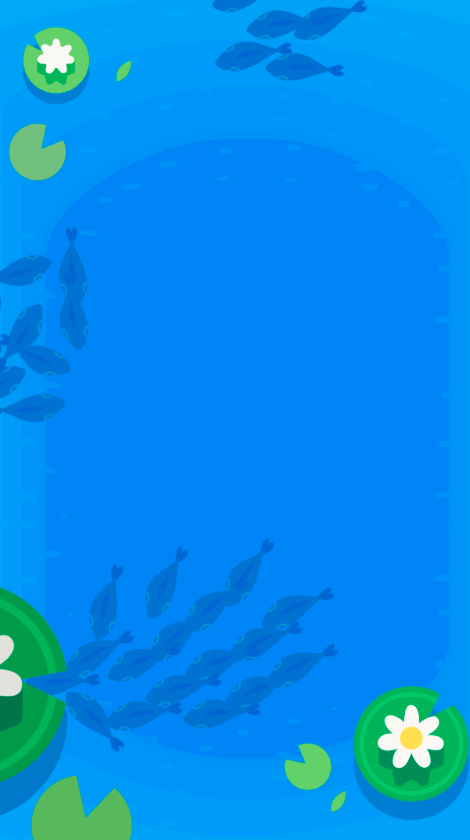

It's great that our fish are reacting to each other, but what about the world around them? You might have noticed that a single-tap on the screen drops some food (fish flakes) and a double-tap creates a ripple...

We want the fish to head towards the food (fish flakes) and move away from the ripples!

> [challenge]
> Before reading any further, how would you make sure a fish is attracted to food? What information do you need?
>
> How would you make sure fish are scared away by ripples? What information do you need?

# Om nom nom

Let's start with moving fish towards food... Fish like food. They need it to survive. When they see food around, they will move towards it.

> [info]
>
> A single-tap on the screen drops some food that sticks around for 7.5 seconds. After that, it disappears. For simplicity, there can only be one food cluster on the screen at a time.

In this diagram, the red fish is being simulated. It can see any food within the red circle. It moves towards food whenever it sees it.

> [challenge]
>
> Fill out `calculateFood`. It should:
>
1. Use `delegate.foodLocation()` to get a `CGPoint?`. This value is `nil` if there is no food on the screen and it has a value if there is food on the screen.
1. If there is food, use the `distanceTo` method to check if it is less than `foodVisibleDistance` away from `self.position`. You can calculate the distance with something like `self.position.distanceTo(foodLocation)`. _This assumes that the return value from the delegate has been unwrapped and binded to_ `foodLocation`.
1. If the distance is less than `foodVisibleDistance`, return a vector to the food's location divided by `foodWeight`. If there is no food or it is too far away, return `CGPoint(x: 0, y: 0)`.
>
> Update `updateVelocity` to use this new rule. `updateVelocity` should:
>
1. Call `calculateFood` and save it to a variable.
1. Reassign the `velocity` instance variable to be the sum of the previous `velocity`, previous rules, and the newly calculated food.
1. Make sure there is a call to `clampVelocity` after you update the `velocity` instance variable.
>
> Run the app and check it out! Try tapping to drop some food. Do the fish swarm around it?

## Success!

At the end of this section you should have your normal fish flocking behavior but they should also rush towards food when there is some on the screen...

# Swim away!

One last thing... Fish hate disturbances in the water. They should scatter away whenever there is a ripple on the screen!

> [info]
>
> A double-tap on the screen creates a ripple that sticks around for 3 seconds. After that, it disappears. For simplicity, there can only be one food cluster on the screen at a time.

In this diagram, the red fish is being simulated. It can see and feel any ripples within the red circle. It moves away from ripples whenever it sees them.

> [challenge]
>
> Fill out `calculateRipple`. It should:
>
1. Use `delegate.rippleLocation()` to get a `CGPoint?`. This value is `nil` if there is no ripple on the screen and it has a value if there is a ripple on the screen.
1. If there is a ripple, use the `distanceTo` method to check if it is less than `rippleVisibleDistance` away from `self.position`. You can calculate the distance with something like `self.position.distanceTo(rippleLocation)`. _This assumes that the return value from the delegate has been unwrapped and binded to_ `rippleLocation`.
1. If the distance is less than `rippleVisibleDistance`, return a vector pointing _away from_ the ripple's location divided by `rippleWeight`. If there is no ripple or it is too far away, return `CGPoint(x: 0, y: 0)`.
>
> Update `updateVelocity` to use this new rule. `updateVelocity` should:
>
1. Call `calculateRipple` and save it to a variable.
1. Reassign the `velocity` instance variable to be the sum of the previous `velocity`, previous rules, and the newly calculated ripple.
1. Make sure there is a call to `clampVelocity` after you update the `velocity` instance variable.
>
> Run the app and check it out! Try double-tapping to make a ripple. Do the fish scatter away?

## Success!

At the end of this section you should have your normal fish flocking behavior but they should also rush towards food when there is some on the screen and scatter away from ripples...

Congratulations! You have a fully functioning, fish schooling, swarm intelligence simulation!
