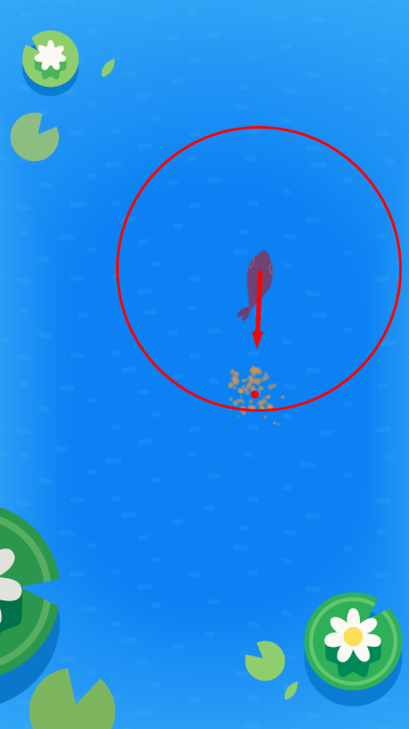
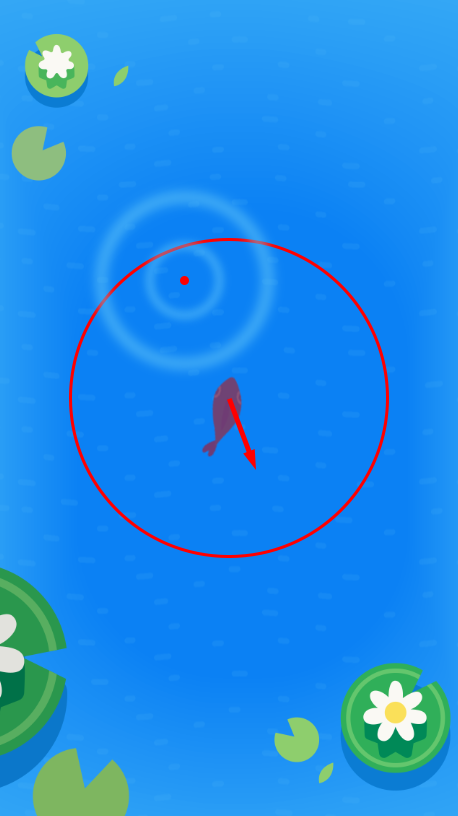

It's great that our fish are reacting to each other, but what about the world around them? You might have noticed that a single-tap on the screen drops some food (fish flakes) and a double-tap creates a ripple...

We want the fish to head towards the food (fish flakes) and move away from the ripples!

> [challenge]
> Before reading any further, how would you make sure a fish is attracted to food? What information do you need?
>
> How would you make sure fish are scared away by ripples? What information do you need?

# Om nom nom

Let's start with moving fish towards food...

A single-tap on the screen drops some food that sticks around for 7.5 seconds. After that, it disappears.

## Success!

At the end of this section you should have your normal fish flocking behavior but they should also rush towards food when there is some on the screen...

<!-- TODO: Need gif of food -->

# Swim away!

One last thing... Fish hate disturbances in the water. They should scatter away whenever there is a ripple on the screen!

A double-tap on the screen creates a ripple that sticks around for 3 seconds. After that, it disappears.

## Success!

At the end of this section you should have your normal fish flocking behavior but they should also rush towards food when there is some on the screen and scatter away from ripples...

<!-- TODO: Need gif of scatter + food -->

Congratulations! You have a fully functioning fish schooling intelligence!
